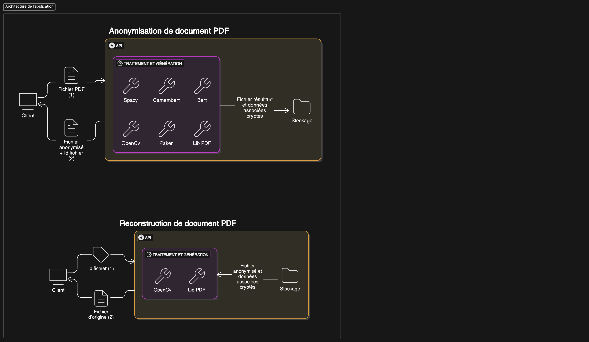

# Anonymisation de documents PDFS

> Cette branche représente une version modifiée, plus propre, de l'application développée durant l'Hackathon, visant à anonymiser des documents PDFS et en bonus pouvoir les reconstruire.

## Description détaillée

### Anonymisation

- Récupération d'un fichier PDF
- Détection des données définies comme étant sensibles (exemple : nom, prénom, numéro de téléphone ...)
- Remplacement de ces données dans deux formats possible, tout en gardant la même logique dans les caractères (un mot avec accent, contiendra un accent) :
  - Sémantiquement similaire (un nom sera remplacé par un nom).
  - Même type (même longueur, même type de caractère à la même position, Bonjour3 -> Ckjbvpl0)
- Génération du PDF résultant ainsi que d'un id de reconnaissance

### Reconstruction

- Récupération d'un id de reconnaissance
- Récupération des données associées
- Remplacement des éléments anonymisés par ceux d'origine
- Génération du PDF résultant (devant ressembler le plus possible à celui d'origine)

## Technologies utilisées

- Python comme langage de traitement
- Spacy
- Bert
- Camembert
- FastApi
- Faker

## Manuel d'intégration

## Améliorations potentielles

- La librairie de parsing et de modification du fichier PDF est **'spire.pdf'**, cette librairie fournie le contenu de la page sous forme d'un bloc de texte formaté à l'apparence du PDF. Les modèles utilisés usant du contexte pour reconnaitre les entités, il peut être plus intéressant d'utiliser pour la capture du texte au niveau du **'PdfParser'** une librairie comme **'fitz de pymupdf''** pour la lecture en bloc du texte d'une page parallèlement à spire.
